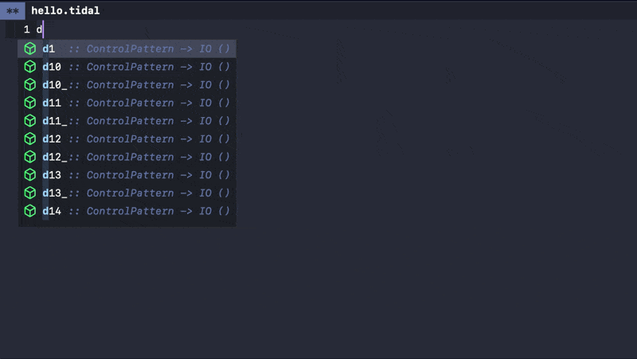

# cape-tidal

A completion-at-point (capf) backend for [TidalCycles](https://tidalcycles.org/).

It works with [Corfu](https://github.com/minad/corfu), [Cape](https://github.com/minad/cape),
or the standard `completion-at-point` — it is a plain capf and does not require Cape at
runtime.



## Features

- Completion candidates from GHCi's `:complete repl` command
- Type information shown as annotations
- Robust behavior with timeouts
- Completion disabled inside strings and comments
- Type information cached for efficiency
- Live-coding first: when a pattern evaluation interrupts, completion yields
  immediately and never hides the evaluation's output (it also fails open, so an
  unresponsive GHCi cannot leave the REPL silent)

## Requirements

- Emacs 27.1 or later
- [tidal.el](https://github.com/tidalcycles/Tidal) (ships with TidalCycles)
- [Cape](https://github.com/minad/cape) — optional, only for the `cape-capf-super`
  example below

## Installation

### use-package + straight.el

```elisp
(use-package cape-tidal
  :straight (:host github :repo "sumisonic/cape-tidal")
  :hook (tidal-mode . (lambda ()
                        (add-hook 'completion-at-point-functions #'cape-tidal nil t))))
```

### use-package + vc-use-package (Emacs 30+)

```elisp
(use-package cape-tidal
  :vc (:url "https://github.com/sumisonic/cape-tidal")
  :hook (tidal-mode . (lambda ()
                        (add-hook 'completion-at-point-functions #'cape-tidal nil t))))
```

### Manual installation

```elisp
(add-to-list 'load-path "/path/to/cape-tidal")
(require 'cape-tidal)
(add-hook 'tidal-mode-hook
          (lambda ()
            (add-hook 'completion-at-point-functions #'cape-tidal nil t)))
```

## Usage

1. Start TidalCycles (`M-x tidal-start-haskell`)
2. In a tidal-mode buffer, trigger completion (`M-TAB`, or your configured
   completion key)

### With Corfu

```elisp
(use-package corfu
  :custom
  (corfu-auto t)
  :init
  (global-corfu-mode))

(use-package cape-tidal
  :hook (tidal-mode . (lambda ()
                        (add-hook 'completion-at-point-functions #'cape-tidal nil t))))
```

### With cape-capf-super

To combine cape-tidal with other completion sources, use `cape-capf-super`
(this is the only part that needs Cape):

```elisp
(use-package cape-tidal
  :hook (tidal-mode . (lambda ()
                        (add-hook 'completion-at-point-functions
                                  (cape-capf-super
                                   #'cape-tidal
                                   #'haskell-completions-sync-repl-completion-at-point
                                   #'cape-dabbrev)
                                  nil t))))
```

## Customization

```elisp
;; Maximum number of completion candidates (default: 100)
(setq cape-tidal-candidates-limit 100)

;; Timeout in seconds for a GHCi response (default: 5.0)
(setq cape-tidal-timeout 5.0)

;; Regexp matching the GHCi prompt (default: "^tidal>")
(setq cape-tidal-prompt-regexp "^tidal>")

;; Longest time, in seconds, to swallow a late response from a discarded
;; request before giving up suppression and falling back to the raw comint
;; output (fail open) (default: 1.0)
(setq cape-tidal-drain-timeout 1.0)

;; Longest time, in seconds, to swallow completion leftovers after a pattern
;; evaluation interrupts (default: 0.3)
(setq cape-tidal-interrupt-drain-timeout 0.3)

;; Per-completion budget of background `:type' requests (default: 20).
;; Candidates on screen are fetched first.
(setq cape-tidal-prefetch-limit 20)

;; Quiet delay, in seconds, between background `:type' requests (default: 0.2)
(setq cape-tidal-prefetch-delay 0.2)

;; Longest time, in seconds, a completion may block Emacs before giving up and
;; returning no candidates; the next keystroke retries (default: 2.0)
(setq cape-tidal-sync-timeout 2.0)
```

## Development

```sh
# byte-compile (must be warning-free)
emacs -Q --batch -f batch-byte-compile cape-tidal.el

# tests (includes fake-GHCi integration tests; no real GHCi needed)
emacs -Q --batch -L . -l cape-tidal.el -l test/cape-tidal-test.el \
  -f ert-run-tests-batch-and-exit
```

## Migrating from company-tidal

Remove the `company-tidal` configuration and follow the installation steps above.

```elisp
;; remove
;; (require 'company-tidal)
;; (add-to-list 'company-backends 'company-tidal)

;; add
(require 'cape-tidal)
(add-hook 'tidal-mode-hook
          (lambda ()
            (add-hook 'completion-at-point-functions #'cape-tidal nil t)))
```

## Troubleshooting

### The last character of the type annotation is clipped

The right edge of a type annotation can lose one character in the completion
popup. This happens with themes that render annotations in italic (an italic
`completions-annotations` face) at a large font size: the overhang of the last
italic glyph is clipped at the popup's right edge. cape-tidal appends a trailing
space to the annotation to mitigate this; if it still clips, turn off the italic
slant for the popup:

```elisp
(set-face-attribute 'corfu-default nil :slant 'normal)
```

## License

GPL-3.0
